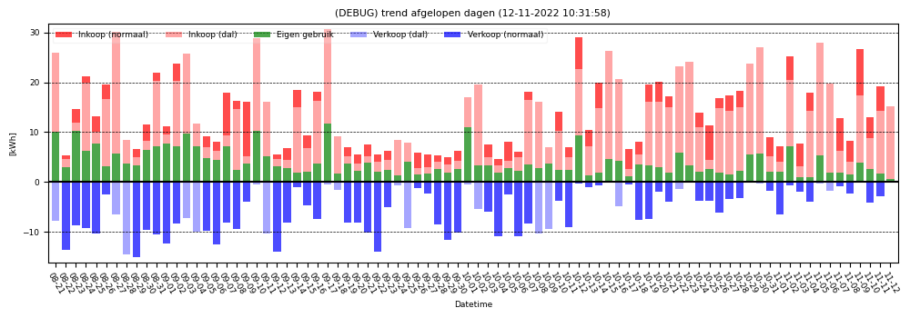
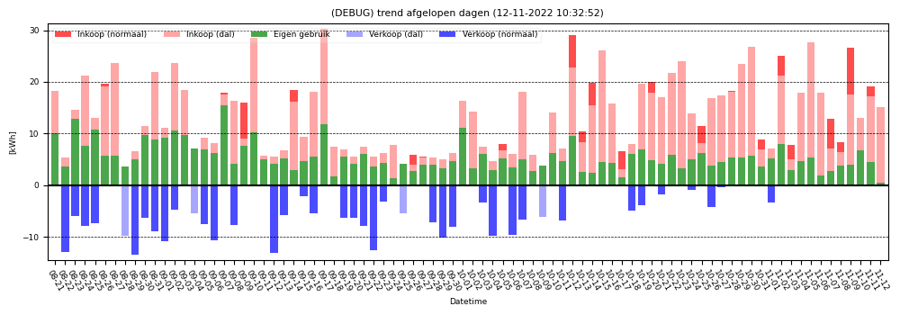
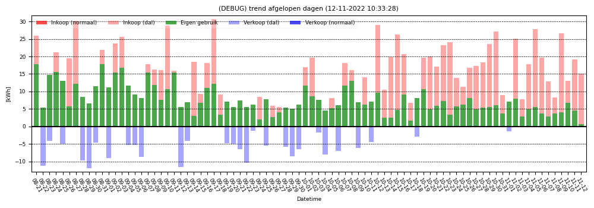

# Trends

## lg-trend.py

### Usage:
`lg-trend.py <option>`

### Options:
`--hours HOURS` : Create a bar graph of electricity usage per hour for the given number of hours.

Example:
`lektrix/bin/lg-trend.py --hours 84`

Two different modifiers are possible:  
`--balance`

`--balances`

The effect of balancing is not always very well visible when using the hours-graph.

`lektrix/bin/lg-trend.py --days 168`

Two different modifiers are possible:  
`--balance`

`--balances`

