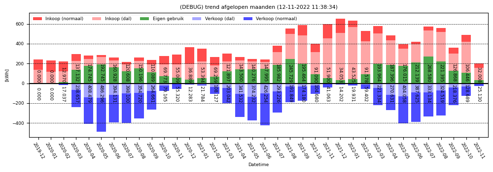
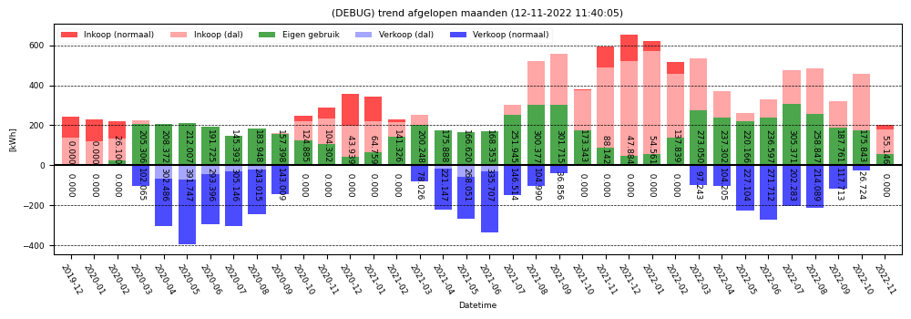
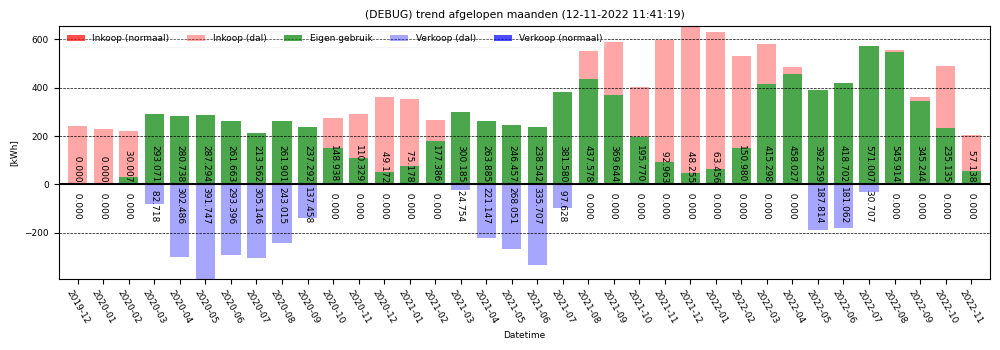

# Trends

## lg-trend.py

### Usage:
`lg-trend.py <option>`

### Options:
`--hours HOURS` : Create a bar graph of electricity usage per hour for the given number of hours.

Example:
`lektrix/bin/lg-trend.py --hours 84`  

Two different modifiers are possible:  
`--balance`  

`--balances`  

`lektrix/bin/lg-trend.py --days 84`  

  
`--balance`  

`--balances`  

`lektrix/bin/lg-trend.py --months 36`  

  
`--balance`  

`--balances`

### Balancing
Balancing is a mathematical excercise that is meant 
to study the effect of energy storage.

`--balances` shows what would happen if all the 
energy that is exported in the unbalanced case could 
be used optimally. So, the (red) imported energy is first 
canceled out by any (blue) exported energy before
creating the graph; effectively maximising the (green) 
own usage part.

`--balance` does the same as the `--balances` option, 
however now the T1 and T2 counters are strictly kept 
separate. 
So, energy exported during the peak hours is only
canceled out against the energy imported during those
same peak hours.

